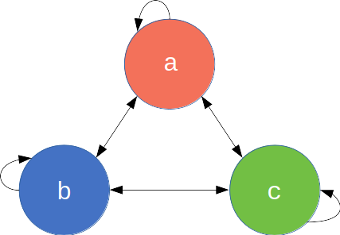

```{r, setup, echo=FALSE, results = 'hide'}
rm(list = ls())
library(knitr)
oldSource <- knit_hooks$get("source")
knit_hooks$set(source = function(x, options) {
  x <- oldSource(x, options)
  x <- ifelse(!is.null(options$ref), paste0("\\label{", options$ref,"}", x), x)
  ifelse(!is.null(options$codecap), paste0("\\captionof{chunk}{", options$codecap,"}", x), x)
})
library(ggplot2)
library(testthat)
knitr::opts_chunk$set(cache = FALSE, fig.width = 7, fig.height = 4, 
                      out.extra = '', out.width = "0.6\\textwidth",
                      fig.align='center', fig.pos = "h")
set.seed(01011885)

# You might need to install the package rticles for the formatting to work.
# To build run
# rmarkdown::render('unit_testing.Rmd')
```
\newpage
# Introduction

Modelling is an important tool for understanding fundamental biological processes in infectious disease dynamics, evaluating potential intervention efficacy and forecasting disease burden.
At the time of writing, infectious disease modellers are playing a central role in the interpretation of available data on the COVID-19 pandemic to inform policy design and evaluation [@ihme; @imperial; @hellewell2020feasibility].
Similarly, policy on endemic infectious diseases, such as duration and frequency of control programmes and spatial prioritisation, is also directed by models [@behrend2020modelling]. 
Such research builds on a long history of modelling for policy [@heesterbeek2015modeling] and a general understanding of the dynamics of infectious disease systems.

<!--
I have a list of high impact bugs, but in summary a few highlights:
- Omission of a minus sign in 1995 cost Fidelity Magellan Fund £1.6million
- In 2013 a PhD student found basic mistakes in a globally influential economics study that was used by many countries to inform austerity
- London 2012 Olympics over-sold 10,000 synchronised swimming tickets
- 2010: MI5 incorrectly bugged over 100 phones due to a code formatting error
- Mars Climate orbiter lost in space due to failure to convert between imperial and metric units (1998)
- Mariner 1 space craft lost in 1962 due to omission of a hyphen
- Kerberas security system trivial to break for 8 years due to failure to correctly seed random number generator
--https://retractionwatch.com/2018/11/05/data-mishap-forces-retraction-of-paper-on-gun-laws-domestic-killings/#more-76505
https://retractionwatch.com/2020/05/05/doing-the-right-thing-researchers-retract-clinician-burnout-study-after-realizing-their-error/
https://retractionwatch.com/2016/09/26/error-in-one-line-of-code-sinks-2016-seer-cancer-study/
--->

<!--
# https://twitter.com/ID_AA_Carmack/status/1254872368763277313 
# https://github.com/mrc-ide/covid-sim/issues/166 Model did not have unit tests. At time of 60da1ecff99001758499292b4751e4fdbb92cfd2
# Does have a basic regression test but this was probably added recently.
--->

Given the importance of modelling results, it is vital that the code they rely on is both coded correctly and trusted.
Bugs have been found in code used by many researchers [@bhandari2019characterization] and may lead to retractions [@retract].
Outside of epidemiology, a paper that informed austerity policies globally was found to be fatally flawed [@herndon2014does].
In engineering bugs caused the Mars Climate orbiter and the Mariner 1 spacecraft to become lost or destroyed [@nasa; @board1999mars].
The issue of trust was highlighted recently when Neil Ferguson, one of the leading modellers informing UK COVID-19 government policy, tweeted:

> "I'm conscious that lots of people would like to see and run the pandemic simulation code we are using to model control measures against COVID-19. To explain the background - I wrote the code (thousands of lines of undocumented C) 13+ years ago to model flu pandemics..." [@ferg_tweet].

The code that was released did not include any tests [@ferg_github].
The tweet and lack of tests garnered considerable backlash (much of which was politically motivated), with observers from the software industry noting that code should be both documented and tested to ensure its correctness.
It is important to note however, that this is not an unusual statement for our field, or for some of the authors of this article. 
To guard against error, policy-makers now standardly request analyses from multiple modelling groups (as is the case in the UK for COVID-19 [@spim]) as a means to provide scientific robustness and reliability [@den2019guidelines], yet this is not enough if the models themselves lack internal validity.

Infectious disease modellers are rarely trained as professional programmers. 
However, today's models are increasingly moving from mean-field ordinary differential equation approximations to individual-based models with complex, data-driven contact processes [@willem2017lessons; @ferguson2006strategies].
These increases in model complexity are accompanied with growing codebases. 
As the mathematical methods depend increasingly on numerical solutions rather than analytical pen-and-paper methods, it becomes more difficult to tell if a bug is present based on model outputs alone.

Traditionally, the workflow is to write the complete code, run the model and examine plots of the output.
This crude *ad hoc* testing approach can miss many bugs.
Furthermore, this workflow is biased as models that show expected behaviour are assumed bug-free, whereas the opposite gets more scrutiny.

_Unit testing_ is a formally-defined, principled framework that compares comprehensive output scenarios from code to what the programmer expected to happen (@wickham2015r Chapter 7, @osborne2014ten, @wilson2014best).
Ready-to-run frameworks for unit testing are available in _R_ [@R], _Julia_ [@bezanson2017julia] and _python_ [@python] and are standard practice in the software industry.
These testing concepts also apply to ecology and other sciences but here we focus on infectious diseases.
Infectious disease modelling presents specific challenges, such as stochastic outputs, which are difficult to test and not covered in general unit testing literature.

In this primer we introduce unit testing with a demonstration on an infectious disease model.
We also outline the available testing frameworks in various languages commonly used by modellers.

# Unit testing foundations
At the heart of every _unit test_ is a function output, its known or expected value and a process to compare the two.
For the square root function $\sqrt{x}$ (`sqrt(x)` in _R_ [@R]), we could write a test that runs the function for the number 4 i.e. `sqrt(x = 4)` and compares it to the correct answer i.e. 2.
However, often our function arguments will cover an infinite range of possibilities and we cannot exhaustively check them all. 
Instead we devise tests that cover standard usage as well as _corner case_ scenarios: what do we want our function to do if given a negative number e.g. `sqrt(-1)`, or a vector argument containing strings or missing values e.g. `sqrt(c(4,"melon",NA))`?

In _R_, the \texttt{testthat} package [@testthat], provides a simple interface for testing.
While a variety of test functions can make different comparisons, the two main ones are `expect_true()` and `expect_equal()`. 
`expect_true()` takes one argument: an expression that should evaluate to `TRUE`.
For our square root example above, we would write `expect_true(sqrt(4) == 2)`.
`expect_equal()` takes two arguments, an expression and the expected output; 
so we would write `expect_equal(sqrt(4), 2)`.

There are a number of ways to incorporate unit testing into your programming workflow.

1. Each time you write code for a new, discrete chunk of functionality, you should write tests that confirm it does what you expect.
2. These same tests should be regularly run as you develop new code.
If a change causes the older tests to break, this points to the introduction of an error in the new code, or implies that the older code could not generalise to the adapted environment.
3. Whenever a bug is found in the code outside of the existing testing framework, a new test should be written to capture it. 
Then if the bug re-emerges it should be caught.
4. You can write tests before you write code---also known as test-driven development.
This can help development planning: write tests that define the desired functionality and continue programming, provided all tests keep passing.
Frameworks for formalising this are discussed later in the paper.

# An example multi-pathogen re-infection model

Here we define a toy epidemiological model and then demonstrate how to effectively write unit tests for it in _R_ code.
Consider a multi-pathogen system, with a population of $N$ infected individuals who each get superinfected by a new pathogen at every time step (Fig. \ref{fig:modelexample}).
In this toy example, we imagine that individuals can only be infected with one pathogen at a time.
Some aspects of this model could reflect the dynamics of a population where specific antibiotics are used regularly i.e. each time step an individual is infected, diagnosed and treated suboptimally, leaving the individual susceptible to infection from any pathogen, including the one they were just treated for. The aim of this model however is not to be realistic but serve as learning tool with succinct code.
```{r modelexample, echo=FALSE, out.width="100%", fig.cap="The 3-pathogen system with arrows showing the possible transitions at every time step.", out.width = 150}

```
Each individual is defined by the pathogen they are currently infected with $I_{it} \in \{a, b, c\}$ for a 3-pathogen system. 
The population is therefore defined by a length $N$ state vector $\mathbf{I}_t$ = $(I_{it})_{i=[1,N]}$.
Each time step, everyone's infection status is updated as:
$$I_{it} = \text{Unif}(\mathbf{I}_{t-1}).$$
That is, at each iteration $t$, the new infection status of each individual $i$ is a Uniform random sample from the set of infection statuses in the previous iteration (including itself $I_{i,t-1}$).
Certainly this toy model is naïve as it is governed by mass-action principles, ignoring contact and spatial dynamics. 
Nevertheless it will serve its purpose. 
\@ref(firstcode) shows our first attempt at implementing this model.
\newline
```{r first_code,  ref = "firstcode", codecap = "Base example of the multi-pathogen re-infection model", results='hide'}
N <- 12 # infected individuals
t <- 20 # study length
# create the matrix to store the simulation data
I <- matrix(data = NA, nrow = t, ncol = N)

# Initialise the population at t = 1 with a fixed configuration
I[1,] <- rep(x = c("a", "b", "c"), length.out = N)

# At each time step, everyone is re-infected 
# by someone from the previous time step.
for(t in seq(2, t)){
  I[t,] <- sample(x = I[t-1,], size = N)
}
```

```{r, firstplots, echo = FALSE, fig.cap = 'Infection profile for individual 1, who is initially infected with pathogen $a$.', out.width = "75%"}
library(ggplot2)
d1 <- data.frame(time = seq(t), pathogen = (I[, 1]), stringsAsFactors = TRUE)
ggplot(d1, aes(time, as.numeric(pathogen))) +
  geom_path() +
  geom_point() +
  scale_y_continuous(breaks = seq(3), labels = c('a', 'b', 'c')) +
  labs(y = 'Pathogen', x = 'Time') +
  theme(panel.grid.minor = element_blank(),
        axis.text.x = element_text(size = 20, family = "serif"),
        axis.text.y = element_text(size = 20, family = "serif"),  
        axis.title.x = element_text(size = 20, family = "serif"),
        axis.title.y = element_text(size = 20, family = "serif")
  )
```

```{r, bug_show_plot, include = FALSE}
apply(I, 1, function(x) table(factor(x, levels = c("a", "b", "c")))) %>% 
      t %>% matplot(type = 'l')
```

Usually we would make some output plots to explore if our code is performing sensibly.
Plotting the time course of individuals' infection pathogen indicates repeated infection with different pathogens as expected (Fig. \@ref(fig:firstplots)).
However, if we look at the proportion of each pathogen through time (not shown here) we quickly see that the pathogen proportions are identical through time and so there must be a bug hiding.
This simple example demonstrates that: 
Firstly, bugs can be subtle.
Secondly, it is not easy to notice an error, even in just 7 lines of code. 
Thirdly, it is much easier to debug code when you know there is a bug. 
Fourthly, while plotting simulation runs is an excellent way to check model behaviour, if we had only relied on Fig. \@ref(fig:firstplots) we would have missed the bug. 
Manually checking plots is a time consuming and non-scalable method because a human has to perform this scan every test run.
In summary this *ad hoc* plotting approach reduces the chances that we will catch all bugs.
\newline
\newline
The cause of the bug is that `sample()` defaults to sampling without replacement `sample(..., replace = FALSE)`; this means everyone transmits their infection pathogen on a one-to-one basis rather than one-to-many as required by the model.
Setting `replace = TRUE` fixes this (\@ref(correctcode)) and when we plot the proportion of each pathogen (Fig. \@ref(fig:correctplots)) we see the correct behaviour (a single pathogen drifting to dominance).
In the subsequent sections we will develop this base example as we consider different concepts in unit testing, resulting in well-tested code by the end. 
\newline
```{r, correctcode, ref = "correctcode", codecap = "Corrected base example", results = 'hide', echo = TRUE}
N <- 12
t <- 20

I <- matrix(data = NA, nrow = t, ncol = N)

I[1,] <- rep(x = c("a", "b", "c"), length.out = N)

for(t in seq(2, t)){
  I[t,] <- sample(x = I[t-1,], size = N, replace = TRUE)
}
```

```{r, correctplots, echo = FALSE, fig.cap = 'The correct behaviour with the proportion of each pathogen drifting to either dominance or extinction. Each pathogen is a different line.', out.width = "75%"}
(apply(I, 1, function(x) table(factor(x, levels = c("a", "b", "c")))) / N) %>% 
  t %>% 
  matplot(type = 'l', xlab = 'Time', ylab = 'Proportion', lwd = 3, lty = c(1,2,4), 
          cex.lab = 1.4, cex.axis = 1.4, xlim = c(1,20), 
          xaxs = "i", col = c('red','blue','darkgreen'), family = "serif")
```

# Basic unit testing
## Write small functions {-#compactfuns}

To ensure the unit tests are evaluating the exact code as run in the analysis, the model code should be defined once within a function.
This same function is then run in both unit tests as well as part of the larger model codebase.
Make your functions compact with a single clearly-defined operation.
We have defined a function, `initialisePop()`, to initialise the population and another, `updatePop()`, to run one iteration of the simulation (\@ref(compactfunctions)).
Organising the codebase into these bite-sized operations makes following the programming flow easier as well as understanding the structure of the code.
At this stage we have also enabled the varying of the number of pathogens using the `pathogens` argument in the `initialisePop()` function.
\newline
```{r, compactfunctions, ref = "compactfunctions", codecap = "Organising code into more compact functions", result = 'hide'}
initialisePop <- function(t, N, pathogens){
  I <- matrix(data = NA, nrow = t, ncol = N)
  I[1,] <- rep(x = letters[1:pathogens], length.out = N)
  return(I)
}

updatePop <- function(x, t, N){
  x[t,] <- sample(x = x[t-1,], size = N, replace = TRUE)
  return(x)
}
```

## Test simple cases first {-#easycases}

If we start with a small population with few pathogens, we can then easily anticipate what the initialised population will look like (\@ref(testsimplefirst)).
\newline
```{r, test_simple_first, ref = "testsimplefirst", codecap = "Using simple parameter sets we can work out beforehand what results to expect", results = 'hide'}
pop1 <- initialisePop(t = 2, N = 3, pathogens = 2) 
expect_equal(pop1[1,], c("a", "b", "a"))

pop2 <- initialisePop(t = 2, N = 3, pathogens = 3) 
expect_equal(pop2[1,], c("a", "b", "c"))

pop3 <- initialisePop(t = 2, N = 4, pathogens = 2) 
expect_equal(pop3[1,], c("a", "b", "a", "b"))
```

## Test all arguments {-#testargs}

`initialisePop()` has three arguments to check.
First we initialise the population, and then alter each argument in turn (\@ref(testallargs)).
Arguments `t` and `N` directly change the expected dimension of the returned matrix so we check that the output of the function is the expected size.
For the `pathogen` argument we test that the number of pathogens is equal to the number requested.
\newline
```{r, test_all_args, ref = "testallargs", codecap = "Test all function arguments in turn", results = 'hide'}
pop1 <- initialisePop(t = 2, N = 3, pathogens = 3) 
expect_equal(dim(pop1), c(2, 3))

pop2 <- initialisePop(t = 6, N = 3, pathogens = 3) 
expect_equal(dim(pop2), c(6, 3))

pop3 <- initialisePop(t = 2, N = 20, pathogens = 3) 
expect_equal(dim(pop3), c(2, 20))

pop4 <- initialisePop(t = 2, N = 10, pathogens = 5) 
expect_equal(length(unique(pop4[1,])), 5)
```

## Does the function logic meet your expectations? {-#complexcases}

We can also cover cases that expose deviations from the logical structure of the system.
After initialising our population, we expect all the rows other than the first to contain `NA`.
We also expect each of the pathogens $a$, $b$ and $c$ to occur at least once on the first row if `pathogens` $\geq 3$ and `N` $\geq 3$.
Finally, `updatePop()` performs a single simulation time step, so we expect only one additional row to be populated.
Instead of testing by their numerical values, we verify logical statements of the results within our macro understanding of the model system (\@ref(testcomplex)).
\newline
```{r, test_complex, ref = "testcomplex", codecap = "Test more complex cases using your understanding of the system", results = 'hide'}
pop1 <- initialisePop(t = 20, N = 12, pathogens = 3) 
# expect all except the first row are NAs
expect_true(all(is.na(pop1[-1,]))) 
# expect all 3 pathogens at t = 1
expect_true(all(c("a", "b", "c") %in% pop1[1,])) 

pop2 <- updatePop(pop1, t = 2, N = 12)
# after update expect 1st & 2nd row not to have NAs
expect_true(all(!is.na(pop2[1:2,]))) 
```

## Combine simple functions and test them at a higher-level{-#combine}

In the end an entire model only runs when its functions work together seamlessly. 
So we next check their connections; achieved through nesting functions together, or defining them at a higher level and checking the macro aspects of the model.
After `fullSim()` is run in \@ref(combinesimplefunc), we would expect there to be no `NA`s left in the population matrix and every element to be either $a$, $b$ or $c$.
\newline
```{r, combine_simple_func, ref = "combinesimplefunc", codecap = "Combine simple functions through nesting to check higher-level functionality", result = 'hide'}
fullSim <- function(t, N, pathogens){
  pop <- initialisePop(t, N, pathogens) 
  for(i in seq(2, t)){
    pop <- updatePop(pop, i, N)
  }
  return(pop)
}

pop <- fullSim(t = 12, N = 20, pathogens = 3)

# expect no NAs
expect_true(!any(is.na(pop))) 
# expect all 3 pathogens contained within
expect_true(all(pop %in% c("a", "b", "c"))) 
```

# Stochastic code

Stochastic simulations are a common feature in infectious disease models.
Stochastic events are difficult to test effectively because, by definition, we do not know beforehand what the result will be.
We can check very broad-scale properties, like \@ref(combinesimplefunc), where we check the range of pathogen values.
However, code could still pass and be wrong (for example the base example (\@ref(firstcode)) would still pass that test).
There are however a number of approaches that can help.

## Split stochastic and deterministic parts {-#splitstochastic}

Isolate the stochastic parts of your code.
For example, `updatePop()` performs stochastic and deterministic operations in one line (\@ref(compactfunctions)).
Firstly, `updatePop()` stochastically samples who gets infected by whom at iteration `t`.
Then it takes those infection events and assigns the new infectious status for each individual.
Finally, it adds the new infectious statuses to the full population matrix for that iteration.
We demonstrate in \@ref(splitdeterstoch) how this could be split.
We accept this is a fairly exaggerated example and splitting a single line of code into three functions is rare!
The more common scenario is splitting a multi-line function which also brings benefits of code organisation so it does not feel like extra effort. 
\newline
```{r, split_deter_stoch, ref = "splitdeterstoch", codecap = "Isolation of the determistic and stochastic elements"}
chooseInfector <- function(N){
  sample(x = N, size = N, replace = TRUE)
}

newInfectionStatus <- function(old_status, infector_pathogen){
  old_status[infector_pathogen]
}

addInfectionStatus <- function(x, t, new_status){
  x[t,] <- new_status
}

updatePopCombined <- function(x, t, N){
  infector_pathogen <- chooseInfector(N)
  new_status <- newInfectionStatus(x[t-1,], infector_pathogen)
  x[t,] <- addInfectionStatus(x, t, new_status)
  return(x)
}
```

Two-thirds of `updatePopCombined()` is deterministic so can be checked as previously discussed.
We still have `chooseInfector()` that is irreducibly stochastic, however there is a suitable technique for it in \@ref(teststochlargenum).

## Pick a smart parameter for a deterministic result{-#deterministicparams}

In the same way that we used simple parameters values, we can often find simple cases for which our stochastic functions become deterministic.
For example, samples from $X\sim\text{Bernoulli}(p)$ always give zeroes for $p=0$ or ones for $p=1$.
In the case of a single pathogen (\@ref(teststochdetermin)), the model is no longer stochastic.
So initialisation with one pathogen means the second time step should equal the first.
\newline
```{r, test_stoch_determin, ref = "teststochdetermin", codecap = "A stochastic function can output deterministically if you can find the right parameter set.", results = 'hide'}
pop <- initialisePop(t = 2, N = 3, pathogens = 1) 
pop <- updatePop(pop, t = 2, N = 3)
expect_equal(pop[1,], pop[2,])
```

## Test all possible answers (if few) {-#allpossible}

Working again with a simple parameter set, there are some cases where the code is stochastic, but with a small, finite set of outputs. 
So we can run the function exhaustively and check it returns all of the possible outputs.
For a population of two people, `chooseInfector()` returns a length-2 vector with the possible elements of 1 or 2.
There are four possibilities when drawing who is infected by whom.
Both individuals can be infected by individual 1, giving the vector {1, 1}. 
Both individuals can be infected by individual 2, giving {2, 2}. 
Both individuals can infect themselves, giving {1, 2}. 
Or finally both individuals can infect each other, giving {2, 1}.
In (\@ref(teststochfewvalues)), `chooseInfector(N = 2)` returns a length-2 vector with the indices of the infector for each infectee. 
`paste0()` then turns this length-2 vector into a length-1 string with two characters; we expect this to be one of "11", "22", "12" or "21".
`replicate()` runs the expression 300 times, but in your unit test you should choose a value high enough so that you are confident that all of the distinct outcomes will have occurred at least once.
\newline
```{r, test_stoch_fewvalues, ref = "teststochfewvalues", codecap = "Testing stochastic output when it only covers a few finite values", results = 'hide'}
# Collapse each draw into a single string to make comparisons easier.
manyPops <- replicate(300, paste0(chooseInfector(N = 2), collapse = ""))
expect_true(all(manyPops %in% c("11", "22", "12", "21")))
```

## Use very large samples for the stochastic part {-#largesamples}

While the previous example worked well for a small set of possible outputs, testing can conversely be made easier by using very large numbers.
This typically involves large sample sizes or numbers of stochastic runs.
For example, the clearest test to distinguish between our original, buggy code (\@ref(firstcode)) and our correct code (\@ref(correctcode)) is that in the correct code there is the possibility for an individual to infect more than one in a single time step.
In any given run this is never guaranteed, but the larger the population size the more likely it is to occur. 
With a population of one thousand, the probability that no individual infects two others is vanishingly rare (\@ref(teststochlargenum)).
We set the seed of a random number generator so that the test is reproducible, otherwise it will be hard to locate the bug when it occurs sporadically.
\newline
```{r, test_stoch_largenum, ref = "teststochlargenum", codecap = "Computing the probability of the stochastic test failing for 1000 individuals", results='hide'}
set.seed(10261985)
n <- 1e3
infector_pathogen <- chooseInfector(n)

# If an individual infects more than one individual, 
expect_true(any(duplicated(infector_pathogen)))
```

If we have an event that we know should not happen, we can use a large number of simulations to provide stronger evidence that is does not stochastically occur.
However, it can be difficult to determine how many times is reasonable to run a simulation, especially if time is short.
This strategy works best when we have a specific bug that occurred relatively frequently (perhaps once every ten simulations or so).
We say that if the bug does not occur even once in 500 simulations, then we are pretty sure we have fixed it.
In our original buggy code (\@ref(firstcode)) we found that the proportions remained identical for entire simulations.
We would expect this to happen only very rarely.
We can run a large number of short simulations to check that this specific bug does not occur by confirming that the proportion of each pathogen is not always the same between the first and last time point.
As long as we find at least one simulation where the proportions of each pathogen are different between the first and last iteration, we know the bug has been fixed.
\newline
```{r, returningpathogen,ref = "returningpathogen", codecap = "Assessing if a bug fix was a likely success with large code runs, when the bug was appearing relatively frequently"}
set.seed(11121955)
manySims <- replicate(500, fullSim(t = 20, N = 40, pathogens = 3), 
                      simplify = FALSE)

# Define a function that calculates whether
#   the pathogen proportions are the same
#   in the first and last time point.
diffProportions <- function(x){
  !identical(table(x[1, ]), table(x[20, ]))
}

# Check that at least one simulation had 
# non-identical proportions.
expect_true(any(sapply(manySims, diffProportions)))
```

# Further testing

## Test incorrect inputs {-#testincorrect}

As well as testing that functions work when given the correct inputs, we must also test that they behave sensibly when given wrong ones.
This typically involves the user inputting argument values that do not make sense.
This may be, for example, because the inputted argument values are the wrong class, in the wrong numeric range or have missing data values.
Therefore it is useful to test that functions fail gracefully if they are given incorrect inputs.
This is especially true for 'external' functions, available to a user on a package's front-end.
However, it is not always obvious what constitutes an 'incorrect value' even to the person who wrote the code.
In some cases, inputting incorrect argument values may cause the function to fail quickly. 
In other cases code may run silently giving false results or take a long time to give an error.
Both of these cases are serious or annoying and can be difficult to debug afterwards.
\newline
\newline
Often for these cases, the expected behaviour of the function should be to give an error.
There is no correct output for an epidemiological model with -1 pathogens. 
Instead the function should give an informative error message.
Often the simplest solution is to include argument checks at the beginning of functions.
We can then use the `expect_error()` function to check that the function gives an error when it should.
This function takes an expression as its first argument and errors if the expression does not throw an error.
\newline
\newline
We can first check that the code sensibly handles the user inputting a string instead of an integer for the number of pathogens.
Because this expression throws an error, `expect_error()` does not throw an error and the test passes.
\newline
```{r, wrong1, ref = "wrong1", codecap = "Testing incorrect pathogen inputs", warning = FALSE}
expect_error(initialisePop(t = 10, N = 4, pathogens = 'three'))
```

Now we contrast what happens if the user inputs a vector of pathogens to the `initialisePop()` function.
Here presumably the intent is to run a simulation with three pathogens: 1, 2 and 3.
\newline
```{r, wrong1b, ref = "wrong1b", codecap = "A failing test for incorrect pathogen inputs", eval = FALSE}
expect_error(initialisePop(t = 5, N = 4, pathogens = 1:3))
```

This test fails because the function does not throw an error.
Instead the code takes the first element of `pathogens` and ignores the rest.
Therefore, a population is created with one pathogen, not three, which is almost certainly not what the user wanted.
Here, the safest fix is to add an explicit argument check at the top of the function as implemented below.
The same test now passes because `initialisePop()` throws an error when a vector is supplied to the `pathogens` argument.
\newline
```{r, wrong1c, ref = "wrong1c", codecap = "New definition of the initialisePop() function and a passing test for incorrect pathogen inputs"}
initialisePop <- function(t, N, pathogens){
  
  # Add an argument check
  if(length(pathogens) > 1) stop('pathogens must have length 1')
  
  I <- matrix(data = NA, nrow = t, ncol = N)
  I[1,] <- rep(x = letters[1:pathogens], length.out = N)
  return(I)
}

expect_error(initialisePop(t = 5, N = 4, pathogens = 1:3))
```

We can similarly check how the code handles a user inputting a vector of numbers to the `t` argument (perhaps thinking it needed a vector of all time points to run).
In \@ref(wrong1c), `initialisePop()` does not throw an error if a vector is supplied to `t`. 
However, `fullSim()` does throw an error if a vector is supplied to `t`.
While it is a good thing that `fullSim()` throws an error, the error message is not very informative.
If the code that runs before the error is thrown (in this case the `initialisePop()` function) takes a long time, it can also be time consuming to work out what threw the error.
It is also a signature of fragile code that the error is coincidental; a small change in the code might stop the error from occurring.
To remedy this we can add an additional argument check to `initialisePop()`.
Importantly, we then want to check that `fullSim()` errors in the correct place (i.e. in `initialisePop()` rather than afterwards).
We can achieve this using the `regexp` argument of `expect_error()` that compares the actual error message to the expected error messages.
The test will only pass if the error message contains the string provided.
\newline
```{r, wrong2, ref = "wrong2", codecap = "Another new definition of the initialisePop() function and a passing test for the fullSim() function."}
initialisePop <- function(t, N, pathogens){
  
  # Argument checks
  if(length(pathogens) > 1) stop('pathogens must have length 1')
  if(length(t) > 1) stop('t must have length 1')

  I <- matrix(data = NA, nrow = t, ncol = N)
  I[1,] <- rep(x = letters[1:pathogens], length.out = N)
  return(I)
}

expect_error(fullSim(t = 1:100, N = 4, pathogens = 3), 
             regexp = 't must have')

```

## Test edge cases and special cases {-#corners}

When writing tests it is easy to focus on standard behaviour.
However, bugs often occur at _edge cases_---when parameters are at their extrema or at special values.
For example, in _R_, selecting two or more columns from a matrix e.g. `my_matrix[,2:3]` returns a matrix while selecting one column e.g. `my_matrix[,2]` returns a vector.
Code that relies on the returned object being a matrix would fail in this edge case.
\newline
\newline
Similarly, special cases can be triggered with parameter sets that do not match the extrema of parameter space. 
This is where understanding of the functional form of the model can help. 
Consider a function `divide(x, y)` that divides `x` by `y`.
We could test this function by noting that `y * divide(x, y)` should return `x`.
If we write code that tests standard values of `x` and `y` such as `2 * divide(3, 2) == 3` we would believe the function works for nearly all values of division, unless we ever try `y = 0`.
\newline
\newline
We checked earlier if the `pathogens` argument of `initialisePop()` worked by verifying if the returned population had the correct number of pathogens.
However, if we set the `pathogens` argument to be greater than the number of individuals in the population we get a population with `N` pathogens.
The function does not therefore pass the test we defined in \@ref(testallargs).
\newline
```{r, edge2, ref = "edge2", codecap = "initialisePop() does not give a population with the correct number of pathogens if N is less than the number of pathogens.", eval = FALSE}
pop <- initialisePop(t = 10, N = 4, pathogens = 5) 
expect_equal(length(unique(pop[1,])), 5)
```

For edge cases like this it may be rather subjective what the correct behaviour should be.
It might be appropriate for the function to throw an error or give a warning if the user requests more pathogens than individuals.
Here however, we will decide that this behaviour is acceptable.
The test above was still useful to highlight this unusual case.
As our expected output from the function has changed, we should change our test to reflect that; we now expect a population with `N` pathogens.
\newline
```{r, edge3, ref = "edge3", codecap = "Check that pathogens is equal to N", eval = FALSE}
N <- 4
pop <- initialisePop(t = 10, N = N, pathogens = N + 1) 
expect_equal(length(unique(pop[1,])), N)
```


# Unit testing frameworks {#frameworks}

Most programming languages have established testing packages.
For _R_, there is the $\texttt{testthat}$ package as already discussed.
When structuring _R_ code as a package, tests should be kept in the directory `tests/testthat`; further requirements to the structure can be found in @wickham2015r Chapter 7.
All the tests in a package can then be run with `test()` from the $\texttt{devtools}$ package [@devtools] or `check()` for additional checks relevant to the package build.
If the code is to be part of a package then these tools are essential to run the code within the context of a build environment.
These tools also provide a clean environment to highlight if a test was previously relying on objects defined outside of the test script.
\newline
\newline
Other programming languages have similar testing frameworks too.
Their specifics differ but the main concept of comparing a function evaluation to the expected output remains the same.
In _Julia_ there is the $\texttt{Test}$ package [@juliatest]. 
The basic structure for tests with this package are demonstrated below.
We name the test and write a single expression that evaluates to `TRUE` or `FALSE`.
For a _Julia_ package, unit tests reside in `test/runtests.jl` and tests are run with `Pkg.test()`.
\newline
```{r, juliatest, ref = "juliatest", codecap = "Julia test example", eval = FALSE}
@testset "my_test_name" begin
  @test sqrt(4) == 2
end
```

Finally, in _python_ we have the $\texttt{unittest}$ framework [@pythonunittest]; tests must be written into a class that inherits from the `TestCase` class.
The tests must be written as methods with `self` as the first argument.
An example test script is shown below.
Tests should be kept in a directory called `Lib/test`, and the filename of every file with tests should begin with `test_`.
\newline
```{r, testpy, ref = "testpy", codecap = "python test example", eval = FALSE}
import unittest
import math

class TestMaths(unittest.TestCase):
    def test_sqrt(self):
        self.assertEqual(math.sqrt(4), 2)

unittest.main()
```

# Continuous integration {#ci}

If your code is under version control [@osborne2014ten; @wilson2014best] and hosted on GitHub, GitLab or BitBucket, you can automate the running of unit tests---also known as _continuous integration_.
In this setup, whenever you push code changes from your local computer to the online repository, any tests that you have defined get run automatically.
Furthermore these tests can be automated irrespective of changes to your code or tests: since dependencies with other packages and knock-on changes from them into a bug in your code can be automatically found and notified to you by email.
There are various continuous integration services such as travis-ci.org, GitHub actions and GitLab pipelines.
These services are often free on a limited basis, or free if your code is open source.
\newline
\newline
We briefly describe the setup of the simplest case---Travis CI.
Setting it up is very straightforward for _R_ code already organised into a package and hosted openly on GitHub. 
Within your version-controlled folder that contains the _R_ code, you add a one-liner `.travis.yml` file that contains a description of which language the code uses.
\newline
```{awk, travis, ref = "travis", codecap = "A basic travis yml file.", eval = FALSE}
language:r
```

This file can also be created with `use_travis()` from the $\texttt{usethis}$ package.
You then sign up to travis-ci.org and point it to the correct GitHub repository.
To authenticate and trigger the first automatic test you need to make a minor change to your code, commit and push to GitHub.
More details can be found in @wickham2015r Chapter 14.3.

# Concluding remarks

It is vital that infectious disease models are coded to minimise bugs.
Unit testing is a well-defined, principled way we can do this.
There are many frameworks that make aspects of unit testing automatic and more informative and these should be used where possible.
\newline
\newline
Setting it up is simple but writing good tests is a skill that takes time, practice and thought.
However, ensuring your code is robust and well-tested saves time and effort in the long run and helps prevent spurious results. 
These qualities are important for the reproducibility of science, but are particularly relevant where code may be shared between individuals or groups, or where you wish to publish your code as a package to be used by others.
Our aim in this paper was to demonstrate tailored results for infectious disease modelling. 
There are number of standard programming approaches to unit testing which would be good followup reading (wickham2015r Chapter 7, @osborne2014ten, @wilson2014best). 
As demonstrated here, it is initially time consuming to program in this way, but over time it will become habitual and both you and the policy-makers who use your models will benefit from it.

# Code availability

Please see the fully-reproducible and version-controlled code at \url{www.github.com/timcdlucas/unit_test_for_infectious_disease}.

# Funding sources
TMP & TDH gratefully acknowledge funding of the NTD Modelling Consortium by the Bill & Melinda Gates Foundation (BMGF) (grant number OPP1184344). 
Views, opinions, assumptions or any other information set out in this article should not be
attributed to BMGF or any person connected with them. 
TMP's PhD is supported by the Engineering & Physical Sciences Research Council, Medical
Research Council and University of Warwick (grant number EP/L015374/1).
TMP thanks Big Data Institute for hosting him during this work. 
All funders had no role in the study design, collection, analysis, interpretation of data,
writing of the report, or decision to submit the manuscript for publication.

# Contributions: CRediT statement

Conceptualization: TCDL TMP

Data curation: TCDL

Formal Analysis: TCDL

Funding acquisition: TDH

Investigation: TCDL

Methodology: TCDL

Project administration: TCDL

Software: TCDL TMP

Validation: TMP

Visualization: TCDL TMP

Writing – original draft: TCDL

Writing – review & editing: TCDL TMP ELD TDH

# References {#references .unnumbered}
